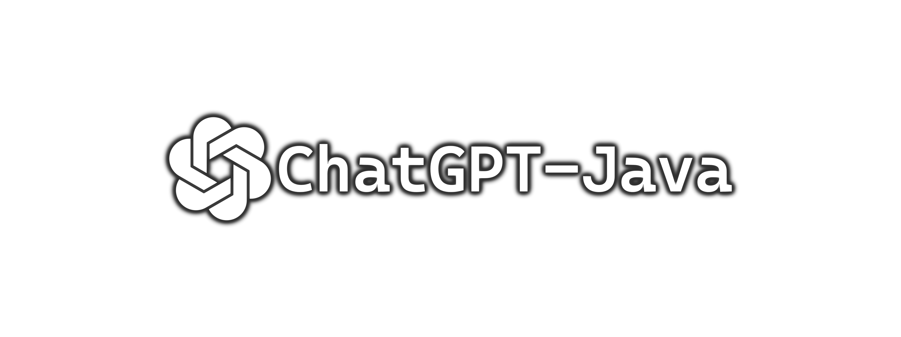

# ChatGPT-Java
A **Java** wrapper for the unofficial reverse-engineered [ChatGPT](https://chat.openai.com/) API.

## Add ChatGPT-Java to your own build
### Maven
```xml
<repository>
  <id>chatgpt-java</id>
  <url>https://raw.github.com/AcaiSoftware/chatgpt-java/repository/</url>
</repository>

<dependency>
  <groupId>gg.acai</groupId>
  <artifactId>chatgpt-java</artifactId>
  <version>1.0</version>
</dependency>
```

## Usage Examples
### Registering ChatGPT
All builder fields are optional except for ``sessionToken``.
```java
ChatGPT chatGpt = ChatGPT.newBuilder()
  .sessionToken("token_here") // required field
  .addExceptionAttribute(new ParsedExceptionEntry("exception keyword", Exception.class)) // optional: adds an exception attribute
  .connectTimeout(60L) // optional: specify custom connection timeout limit
  .readTimeout(30L) // optional: specify custom read timeout limit
  .writeTimeout(30L) // optional: specify custom write timeout limit
  .build(); // builds the ChatGPT client
```

### Session Token
Not required, the ChatGPT client checks & verifies the session token upon the build procedure.
The client will throw a `TokenExpiredException` if the token has expired.
```java
 chatGpt.getComplexAccessCache().refreshAccessToken() // refreshing cache and verifies session token
    .whenComplete((accessToken) -> { // called when the promise is completed, not required
        System.out.println("Access token: " + accessToken);
    });
```

### ChatGPT Conversation
Supports both asynchronous & synchronous handling.

Create a conversation with a promise completing the response:
```java
Conversation conversation = chatGpt.createConversation();
conversation.sendMessageAsync("Hello!")
    .whenComplete((response) -> { // called when the promise is completed with its response
        System.out.println("Response: " + response);
    });
```

Create a conversation with an event stream listener:
```java
Conversation streamConversation = chatGpt.createStreamConversation(new StreamResponseListener() {
    @Override
    public void onResponse(StreamResponse response) {
        System.out.println(response.getMessage()); // the response from the event stream
    }
});
streamConversation.sendMessageAsync("Hello!"); // does not support promise callbacks
```
**NOTE: A Stream Conversation does not support promise callbacks with its response**

## Documentation
// Link to docs

## Features
* Functional Style
* Sending messages with responses
* Event Stream Response
* Asynchronous & Synchronous methods
* Token Access Cache
* Conversations
* Simple Builders
* Easy to use, but powerful
* Optimal performance

## Important Notes
Due to the fact that this is developed using the unofficial reverse-engineered API, be aware that it could break at any time.
However, we will work to fix any issues as they may arise.

## Contributing
Contributions are highly appreciated! If you feel your pull request is useful, go ahead!
Before creating a pull request, make sure your changes works as it should and give a description on what it provides.

## Authors
[Kaiser](https://github.com/KaiserBloo)
[Clouke](https://github.com/Clouke)
